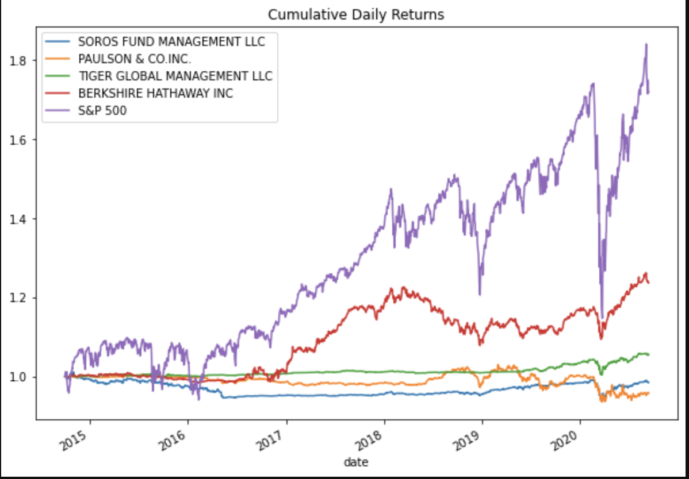
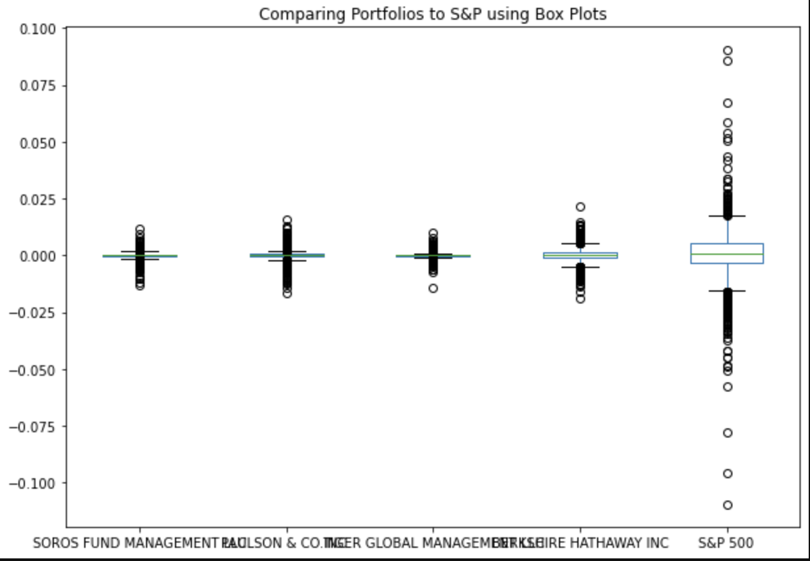
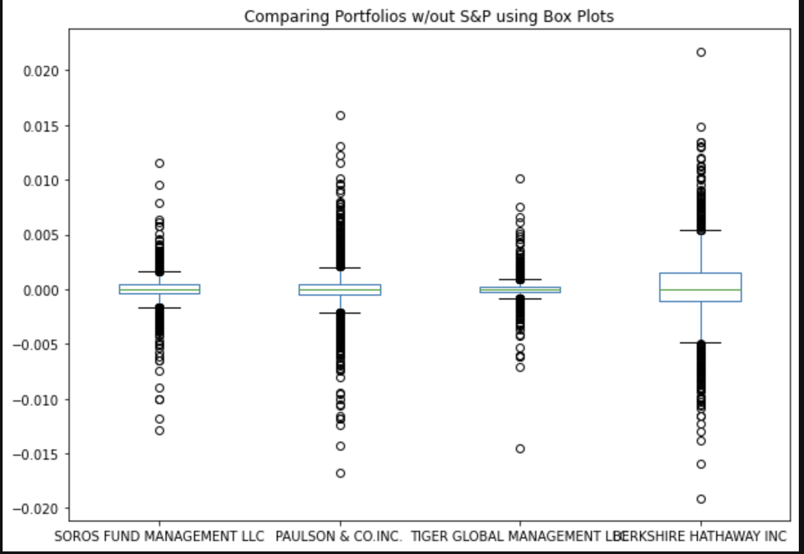
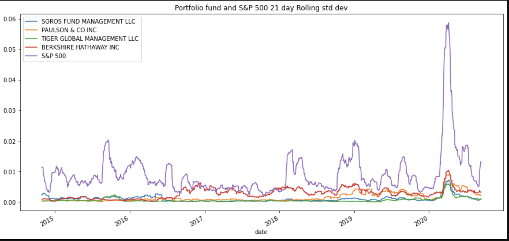

# Challenge_Four by Matthew Rudd

## Purpose

My goal with this platform was to create a one stop shop for online investment/retirement portfolios.  Using the pandas libraries I was able to calculate important ratios to help me choose a top tier performing portfolio.  Using key financial ratios like variance, beta, sharpe ratio, rolling beta, etc, I was able to measure volatility and compare to S&P 500 returns to find best performing portfolios.  Further in the ReadMe you will see visual examples of graphs from the program that allowed me to distinguish which portfolio would return the best yield.      

## Examples

## Contributors
Matthew P Rudd - mprudd2@gmail.com

## License 
MIT
